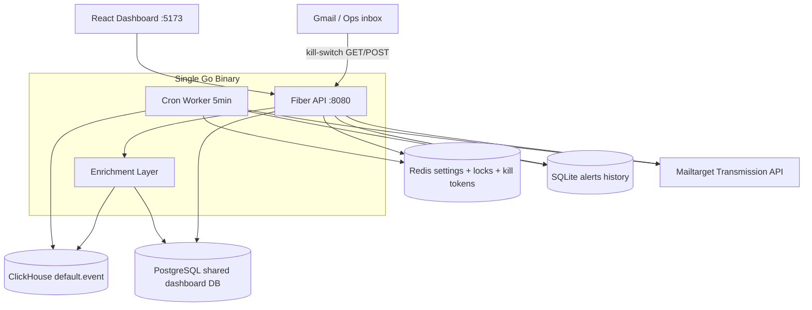

# AGENTS.md — Mailtarget Sentinel

> **Audience:** AI coding agents (Cursor, Antigravity, JetBrains AI, Copilot, etc.)  
> **Purpose:** Onboard quickly when the human switches IDE or starts a new agent session.  
> **Read this file first** before making changes.

---

## 1. Project Summary

**Mailtarget Sentinel** is a hackathon project: real-time anomaly detection + circuit breaker for Mailtarget sub-accounts, with a **super-user dashboard** backed by shared PostgreSQL (dashboard-api-service).

| Layer | Tech |
|-------|------|
| Backend | Go 1.26, Fiber v2 — **single binary** (`cmd/sentinel/main.go`) |
| Analytics DB | ClickHouse — **read-only** `default.event` (metrics, at-risk detection) |
| Metadata DB | PostgreSQL — **read + status writes** (`company`, `sub_account`, `domain`) |
| Settings / locks | Redis |
| Alert history | SQLite (`./data/sentinel.db`) |
| Dashboard | React 19 + Vite (`web/`) |
| External APIs | Mailtarget Transmission (emails only) |

**Core flow:** Cron worker (every 5 min) scans ClickHouse → detects bounce/spam anomalies → enriches with PostgreSQL names → saves SQLite history → sends AMP alert email with kill-switch link → operator can suspend sub-account via dashboard or email webhook (`UPDATE sub_account.status` in PostgreSQL).

**Data principle:** ClickHouse first for detection/metrics; PostgreSQL enriches with company/sub-account/domain metadata; suspend/resume writes directly to PostgreSQL.

---

## 2. Architecture



---

## 3. Repository Layout

```
mailtarget-sentinel/
├── cmd/sentinel/main.go          # Entry point: API + cron worker
├── internal/
│   ├── clickhouse/               # EventRepository — metrics, DetectAnomalies
│   ├── postgres/                 # Company, SubAccount, Domain repos (pgxpool)
│   ├── service/                  # RiskEnricher — CH-first + PG merge
│   ├── redis/                    # Settings, alert dedup locks, kill-switch tokens
│   ├── sqlite/                   # Alert history CRUD
│   ├── mailtarget/               # Transmission client (emails); subaccount_client legacy
│   ├── worker/                   # Detector cron + ResendKillSwitchEmail
│   ├── handler/                  # Fiber route handlers (+ scope.go companyFilter)
│   ├── alert/                    # Email builders (AMP kill-switch, warning)
│   ├── config/                   # Env-based config
│   └── middleware/               # CORS, AMP CORS
├── web/                          # React dashboard
│   ├── src/pages/                # Overview, AtRisk, Companies, SubAccounts, History, Settings
│   └── src/api/sentinel.ts       # Frontend API client
├── scripts/clickhouse/           # init.sql, seed scripts
├── event-clickhouse-ddl.sql      # REFERENCE ONLY — do not run/modify for app logic
├── transmission-openapi-spec.json
├── apiconfig-openapi-spec.json
├── docker-compose.yml            # clickhouse + redis (+ optional sentinel)
├── Makefile
├── .env.example
└── AGENTS.md                     # This file
```

---

## 4. Local Development

```bash
cp .env.example .env
cp web/.env.example web/.env
# Set POSTGRES_DSN (shared dashboard-api-service DB)
# Set MAILTARGET_API_KEY, SENTINEL_ADMIN_TOKEN, VITE_SENTINEL_ADMIN_TOKEN

make install
make infra-up              # ClickHouse :9000, Redis :6379
make clickhouse-seed-287   # Demo data: company 287, sub-account 4302 (~8% bounce)
make dev                   # Backend :8080 + Frontend :5173
```

| Command | Purpose |
|---------|---------|
| `make backend` | Go API + worker only |
| `make frontend` | Vite dev server |
| `make worker-run` | Manual worker trigger |
| `make clickhouse-client` | ClickHouse shell |
| `go test ./...` | Run tests |
| `go build -o bin/sentinel ./cmd/sentinel` | Production binary |

**Demo seed expires in ~5 minutes** (events use `now()` window). Re-run `make clickhouse-seed-287` before demos.

---

## 5. Environment Variables

### Root `.env`

| Variable | Notes |
|----------|-------|
| `POSTGRES_DSN` | **Required.** Shared PostgreSQL from dashboard-api-service |
| `COMPANY_ID` | `0` = super-user (all companies); `287` = scoped testing |
| `PUBLIC_BASE_URL` | Base URL embedded in kill-switch email links. **`localhost` only works on the dev machine**, not from Gmail |
| `MAILTARGET_API_KEY` | Bearer token for Transmission API (emails only) |
| `SENTINEL_ADMIN_TOKEN` | Protects admin endpoints (manual-override, worker/run, email resend) |
| `KILL_SWITCH_HMAC_SECRET` | HMAC for kill-switch token generation |
| `SQLITE_PATH` | Default `./data/sentinel.db` |
| `CORS_ORIGINS` | Dashboard origins, comma-separated |

### Company scope (`COMPANY_ID`)

| Value | Behavior |
|-------|----------|
| `0` or empty | Full super-user — all companies in CH + PG |
| `> 0` | Scoped — worker + list endpoints filter to that company |
| `?company_id=` query param | Overrides env when present |

### `web/.env`

| Variable | Notes |
|----------|-------|
| `VITE_SENTINEL_ADMIN_TOKEN` | Must match `SENTINEL_ADMIN_TOKEN` for Suspend/Resume/Email buttons |

**Shell sourcing note:** Values with spaces (e.g. `ALERT_FROM_NAME=Mailtarget Sentinel`) may warn when `.env` is sourced via bash — quote them in `.env` if needed.

---

## 6. API Endpoints

Base path: `/api/v1/sentinel`  
Response envelope: `{ "success": bool, "data": ..., "error"?: string }`

| Method | Path | Auth | Description |
|--------|------|------|-------------|
| GET | `/health` | — | Health check (outside `/api`) |
| GET | `/metrics` | — | ClickHouse metrics per sub-account |
| GET | `/companies` | — | PostgreSQL company list (`?at_risk=true`, `?include_risk=true`) |
| GET | `/companies/at-risk` | — | CH anomalies + PG-enriched names |
| GET | `/companies/at-risk/summary` | — | Company rollup only (PG-enriched) |
| GET | `/settings` | — | Redis thresholds |
| POST | `/settings` | — | Update thresholds |
| GET | `/alerts` | — | SQLite history (paginated) |
| GET | `/alerts/overview` | — | Dashboard KPIs |
| GET | `/alerts/:id` | — | Single alert |
| GET | `/sub-accounts` | — | PostgreSQL list + ClickHouse metrics |
| GET | `/sub-accounts/:id` | — | Sub-account detail (PG + CH) |
| POST | `/manual-override` | Admin | Suspend / resume via PostgreSQL UPDATE |
| POST | `/sub-accounts/warning-email` | Admin | Send warning email (no kill-switch) |
| POST | `/sub-accounts/kill-switch-email` | Admin | Resend anomaly + kill-switch email |
| POST | `/alerts/kill-switch-email` | Admin | Same resend, body `{ alert_id }` |
| POST | `/worker/run` | Admin | Trigger detection worker |
| GET/POST/OPTIONS | `/kill-switch/` | Token | AMP webhook — suspend via email link |

Admin auth header: `Authorization: Bearer <SENTINEL_ADMIN_TOKEN>`

---

## 7. Dashboard Pages

| Route | File | Data source |
|-------|------|-------------|
| `/` | `web/src/pages/Overview.tsx` | alerts/overview, at-risk summary (PG names) |
| `/at-risk` | `web/src/pages/AtRisk.tsx` | companies/at-risk (CH + PG enriched) |
| `/companies` | `web/src/pages/Companies.tsx` | GET /companies (PG + CH at-risk badge) |
| `/sub-accounts` | `web/src/pages/SubAccounts.tsx` | sub-accounts (PG + CH) |
| `/history` | `web/src/pages/History.tsx` | alerts |
| `/settings` | `web/src/pages/Settings.tsx` | settings |

Vite proxies `/api` → `http://localhost:8080` (`web/vite.config.ts`).

Action buttons (admin token required): **Kill Switch** (resend email), **Warning**, **Suspend**, **Resume**.

---

## 8. Critical Business Logic

### Anomaly detection (`internal/clickhouse/event_repository.go`)

- Window: `5m`, `15m`, `1h` via `injection_time >= now() - INTERVAL N SECOND`
- Thresholds from Redis: `min_volume`, `bounce_rate_threshold_pct`, `spam_rate_threshold_pct`
- Spam = bounces with `bounce_classification_code IN (50,51,52,53,54)`
- **`DetectAnomalies` SQL arg order:** when `company_id` filter is set, args must be `[companyID, minVolume, bounceThreshold, spamThreshold]` — placeholders appear in that order in SQL

### Worker dedup (`internal/worker/detector.go`)

1. Always `INSERT` alert to SQLite (`status=detected`)
2. Redis `TryAcquireAlertLock` — skip email if cooldown active (default 30 min)
3. Create kill-switch token in Redis (TTL 24h, one-time consume via `GetDel`)
4. Send via Transmission API
5. Update SQLite → `alert_sent`

### Kill-switch email resend (`internal/worker/kill_switch_email.go`)

- **Bypasses** Redis dedup lock (manual operator action)
- Creates **new** token + new SQLite alert row
- Used by dashboard "Kill Switch" / "Resend Kill Switch" buttons

### Sub-account suspend/resume (`internal/handler/subaccount_action.go`)

- Calls PostgreSQL: `UPDATE sub_account SET status = $1, updated_at = NOW() WHERE id = $2`
- Used by manual-override, kill-switch, and worker suspend paths
- Status values: `"Active"`, `"Suspended"`, `"Terminated"` (match dashboard-api-service)

---

## 9. Known Issues & Workarounds

| Issue | Detail | Workaround |
|-------|--------|------------|
| Kill-switch from Gmail | Email links use `PUBLIC_BASE_URL=localhost:8080` | Use ngrok/tunnel or public URL for real email testing |
| Token one-time use | Kill-switch token deleted on first use (`GetDel`) even if suspend fails | Resend via dashboard button |
| Seed data expiry | ClickHouse seed uses recent `injection_time` | Re-run `make clickhouse-seed-287` every ~5 min for demos |
| Primary sub-account | Sub-account **513** cannot be suspended (primary) | Demo uses **4302** in seed |
| `.env` names with spaces | `source .env` may error on unquoted values | Quote `ALERT_FROM_NAME`, `ALERT_TO_NAME` |
| PostgreSQL required | App exits on startup if `POSTGRES_DSN` cannot connect | Point to shared dashboard-api-service DB |

---

## 10. Reference Files — DO NOT MODIFY

These define external contracts / existing infrastructure:

- `event-clickhouse-ddl.sql` — ClickHouse schema (data already exists in prod-like env)
- `transmission-openapi-spec.json` — `POST /layang/transmissions`
- `apiconfig-openapi-spec.json` — legacy reference; suspend/resume no longer uses API Config

Go models mirror OpenAPI: `internal/mailtarget/models.go`

Status values: `"Active"`, `"Suspended"`, `"Terminated"`

---

## 11. Coding Conventions

- **Minimal diffs** — match existing patterns; don't refactor unrelated code
- **Single binary** — no microservices; worker runs in same process as API
- **Handler → repository** — business SQL in `internal/clickhouse`, not handlers
- **JSON field names** — snake_case in API responses (e.g. `sub_account_id`)
- **Logging** — `log/slog` JSON to stdout
- **Errors** — use `pkg/response` envelope helpers
- **Frontend** — functional React, no heavy state libs; API calls in `web/src/api/sentinel.ts`
- **Comments** — only for non-obvious business logic (workarounds, external API quirks)
- **Tests** — add only when requested or for non-trivial logic
- **Secrets** — never commit `.env`; warn if user asks to commit credentials

---

## 12. Mailtarget Client Methods

`internal/mailtarget/transmission_client.go`:
- `Send` → `POST /layang/transmissions`

Uses `Authorization: Bearer {MAILTARGET_API_KEY}`.

`internal/mailtarget/subaccount_client.go` — **legacy/unused** after PostgreSQL refactor.

---

## 13. SQLite Alert Statuses

```
detected → alert_sent → suspended | resolved
```

Updated by: worker (detected/alert_sent), kill-switch/manual-override (suspended/resolved).

---

## 14. Common Agent Tasks

### "Dashboard at-risk is empty"
1. Check ClickHouse has recent data: `make clickhouse-seed-287`
2. Verify backend running on `:8080`
3. Check `COMPANY_ID` matches seed (287)
4. Confirm `DetectAnomalies` SQL arg order (see §8)

### "Add new API endpoint"
1. Handler in `internal/handler/`
2. Register in `cmd/sentinel/main.go`
3. Add typed client in `web/src/api/sentinel.ts`
4. Wire UI in relevant page under `web/src/pages/`

### "Email not sending"
1. Check `MAILTARGET_API_KEY` and sender domain verification
2. Check worker logs for `transmission API 401`
3. Use `POST /sub-accounts/kill-switch-email` to test manually

### "Kill-switch link doesn't work from email"
1. `PUBLIC_BASE_URL` must be publicly reachable
2. Backend + Redis must be running
3. Token may already be consumed — resend email

---

## 15. Files Safe to Ignore

- `web/node_modules/`, `web/dist/`
- `bin/`, `data/sentinel.db` (local runtime)
- `scripts/debug_subaccount.go` (dev diagnostic script, not part of app)

---

## 16. Git / PR Notes

- Do not commit unless user explicitly asks
- Do not force-push to main
- Human README: [`README.md`](README.md) — user-facing quick start (may be less detailed than this file)

---

*Last updated: PostgreSQL super-user mode — PG enrichment, direct status writes, Companies page.*
